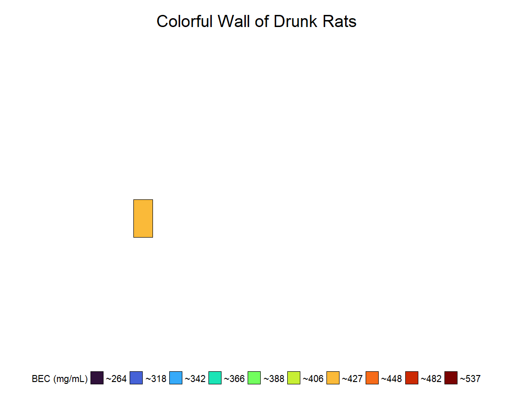

# **Creative Data Visualization - Colorful Wall of Drunk Rats (Stephen Collins)**

A .jpeg and .gif version of my plot is saved within the repository.

## Preliminaries 

Loading the packages that I am going to use for this assignment.

```{r}
#| warning: FALSE 
#| output: FALSE

library(tidyverse)
library(sjmisc)
library(gganimate)
```

## Data 

In our lab, we use a binge-like model of ethanol exposure in rats to study the effects of binge drinking on the brain. During each binge experiment, we collect data to track how intoxicated rats become and whether they experience withdrawal. Since we have all this data just sitting around, I got the idea to look at whether there were any sex differences in our model. So, I recently compiled all of the binge data our lab has collected over the years into one dataset. The dataset I am using here includes parameters such as level of intoxication, ethanol dose (g/kg), blood ethanol concentrations (BEC; mg/dL), and withdrawal severity for adult male and female rats.

```{r}
# loading my rat binge data 
bf <- "data/binge_master_file.csv"
bd <- read_csv(bf, col_names = TRUE)
```

## Data Wrangling 

The original dataset contains a lot of different variables that are not necessary for this assignment, but this is an example of what is in my dataset:

```{r}
glimpse(bd)
```

I selected the variables and filtered the data to include only what I was interested in using for the creative data visualization.

-   **study:** What study did they come from

-   **binge_location:** Where was the study done (UT Austin or Kentucky)

    -   I only want rats that were binged at UT Austin

-   **treatment:** ethanol, controls, or unbinged Controls (UBC)

    -   I only want rats that received ethanol

-   **sex:** males and females

-   **early_death:** Did the animal die during the binge

    -   I only wanted rats that completed the binge

-   **mean_intox:** A mean score showing how intoxicated the rats were across the binge, on a scale from 0 (normal) to 5 (very intoxicated).

-   **mean_withdrawal:** A mean score showing withdrawal severity after the binge, on a scale from 0 (normal) to 4 (severe withdrawal).

-   **mean_bec:** Their blood ethanol concentration (BEC) during the binge, shown as mg/dL

For this project, I ended up focusing only on BECs because this is the best way to know how drunk a rat really is.

```{r}
#setting seed because I am going to randomly assign an ID number and placement later, and I wanted to keep it all consistent
set.seed(34) 

# This creates a data frame that has the x and y values for the grid I am making and is based on the total number of rats I have
# The slice_sample() randomly assigns the x and y value ; where each rat will be placed on my grid 
grid_position <- expand.grid(x = 1:23, y = 1:8) |> 
  slice_sample(prop = 1)

# Creating the new data frame that I am planning on using for my plot 
bd2 <- bd |>
  # selecting my variables 
  select(study, binge_location, treatment, sex, early_death,mean_intox, mean_withdrawal, mean_bec) |>
  # filtering data that I do want to include 
  filter(binge_location == "texas",
         early_death == "no",
         treatment == "ethanol") |> 
  # I went ahead and removed any rats that would be considered outliers
  filter(
    mean_bec >= quantile(mean_bec, 0.25) - 1.5 * IQR(mean_bec), 
    mean_bec <= quantile(mean_bec, 0.75) + 1.5 * IQR(mean_bec)) |> 
  
  # I added extra columns/variables to my data frame
  mutate(mean_bec = round(mean_bec, digits = 0), # I first round my BECs to the nearest whole number
         id_number = sample(1:n(), size = n(), replace = FALSE),  # I randomly assigned an ID number
         bec_grouped = split_var(mean_bec, n = 10), # I then split my BECs values into 10 roughly equal groups 
         x = grid_position$x, # I then added the randomly assigned x and y values for the grid 
         y = grid_position$y)
  


# I created another data frame that contains the mean BECs for each of the 10 groups I made above; I used this to help me make my figure legend

bd3 <- bd2 |>
  group_by(bec_grouped) |>
  summarise(group_mean = mean(mean_bec), na.rm = TRUE) |> #mean BEC for each 10 of the groups 
  mutate(group_mean = round(group_mean, digits = 0)) |> #I rounded the BECs to the nearest whole number just incase
  mutate(avg_group_mean = paste0("~", group_mean)) #this added a "~" in front of each number to be shown in the figure legend

  

```

## **Colorful Wall of Drunk Rats - "Stained Glass Panel"**

Last year, I took a 3-month stained glass course. It was something I had always wanted to try, and it turned out to be one of the coolest hobbies. So, for my creative data visualization, I decided that I should try to combine the binge data I had been working on and some type of stained glass. The idea was to create one stained glass panel (heatmap), where each glass piece (rectangle) represents a random rat from my dataset, which could be a male or female. I divided the rats into 10 roughly equal groups based on their blood ethanol concentrations (BECs), and each group was assigned a color. The figure legend shows each color and the average BEC value associated with each group.

A .jpeg version of my plot is saved within the repository.

```{r}
#| warning: FALSE
#| fig-width: 15
#| fig-height: 13
#| dpi: 300
#| out-width: "200%"

# I used {ggplot2} to make my stained glass panel. 

bec_stained_glass <- ggplot(bd2, aes(x = x, y = y, fill = bec_grouped)) +
  geom_tile(color = "black", size = 0.5) + # size of tiles 
  scale_fill_viridis_d(option = "H", direction = 1, labels = bd3$avg_group_mean) + # fills in the tiles based on my "fill" variable 
  coord_fixed(ratio = 8/4) + # chanages the size of the panel
  theme_void() + # gets rid of all the background things that is normally there
  theme(legend.position = "bottom", # adjusting the titles and figure legend 
        legend.title = element_text(size = 20),
        legend.text = element_text(size = 20),
        legend.key.size = unit(1, "cm"), 
        plot.title = element_text(face = "bold", hjust = 0.5, size = 36),
        plot.title.position = "plot") +
  labs(fill = "BEC (mg/mL)", title = "Colorful Wall of Drunk Rats") + #adds titles 
  guides(fill = guide_legend(nrow = 1)) + # helps make the figure legend one line
  scale_x_continuous(expand = expansion(mult = 0.09)) +
  scale_y_continuous(expand = expansion(mult = 0.06)) # more adjusting of the panel to fit in the quarto better

bec_stained_glass
  
```

I next thought it would be cool if I could make each glass piece (rectangle) slowly appear and stay until the panel was completed. I was able to find a package called {gganimate} that lets you animate your plots - it is pretty cool to be honest. There is also a whole side of R where people make art using R, and it is called Generative Art, which is also cool. Anyway, I used the **transition_time()** and the **shadow_mark()** functions to help me do this. The order of each glass piece (rectangle) appearing is based on the random ID number I assigned earlier. This code block/chunk doesn't run because it won't let me render it to HTML, but I included a .gif version of my plot in the Quarto, and I have it saved within the repository.

```{r}
#| eval: FALSE
#| warning: FALSE
#| output: FALSE

# I used {ggplot2} to make my stained glass panel. 

bec_stained_glass2 <- ggplot(bd2, aes(x = x, y = y, fill = bec_grouped)) +
  geom_tile(color = "black", size = 0.5) + # size of tiles 
  scale_fill_viridis_d(option = "H", direction = 1, labels = bd3$avg_group_mean) + # fills in the files based on a "fill" variable 
  coord_fixed(ratio = 8/4) + # chanages the size of the panel
  theme_void() + # gets rid of all the background things that is normally there
  theme(legend.position = "bottom", # adjusting the titles and figure legend 
        legend.title = element_text(size = 20),
        legend.text = element_text(size = 20),
        legend.key.size = unit(1, "cm"), 
        plot.title = element_text(face = "bold", hjust = 0.5, size = 36),
        plot.title.position = "plot") +
  labs(fill = "BEC (mg/mL)", title = "Colorful Wall of Drunk Rats") + #adds titles 
  guides(fill = guide_legend(nrow = 1)) + # helps make the figure legend one line
  scale_x_continuous(expand = expansion(mult = 0.09)) +
  scale_y_continuous(expand = expansion(mult = 0.06)) + # more adjusting of the panel to fit in the quarto better
  transition_time(id_number) + # adds each tile based on their ID number which was randomly assigned 
  shadow_mark(past = TRUE, future = FALSE) #this keeps the tile that just appeared visible  

animate(bec_stained_glass2, nframes = 184, fps = 2.5, width = 1100, height = 850, renderer = gifski_renderer())

anim_save("bec_stained_glass2.gif")
```

\
A .gif of my animated stained glass panel.

```{r}

```
